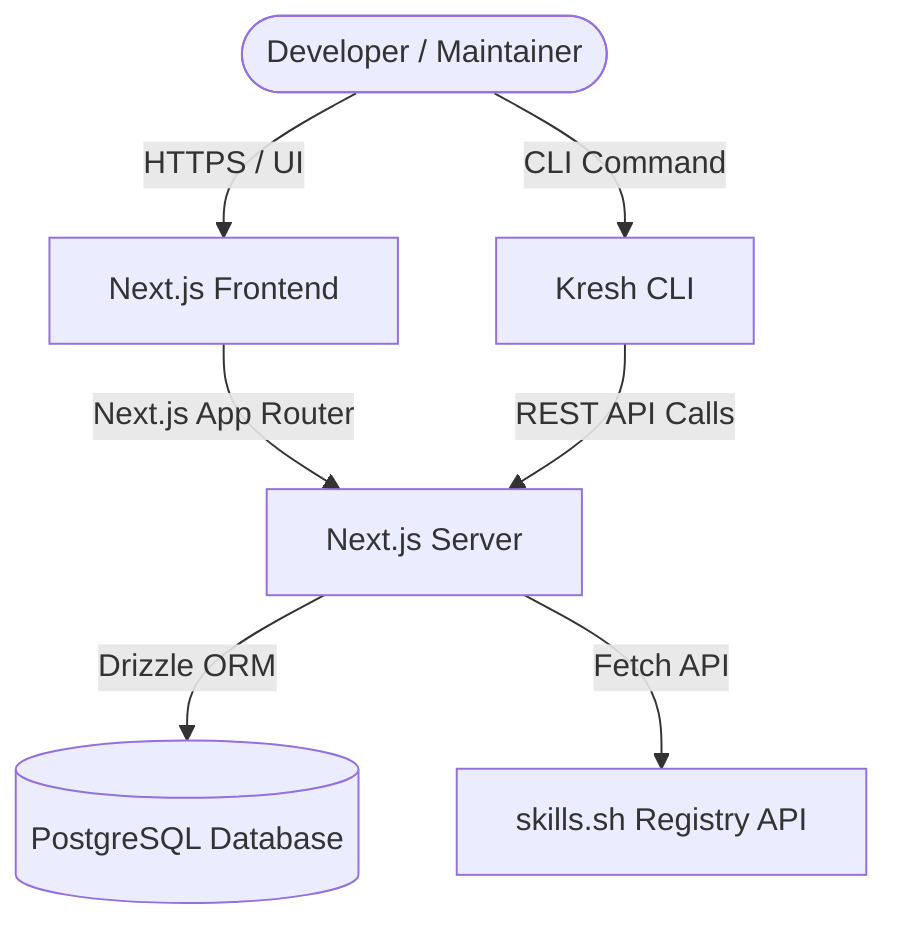

# Kresh System Architecture

Kresh is structured as a standard Next.js Web/API Application with an integrated CLI client and an external PostgreSQL database.

## System Components

### 1. Next.js Web Client (Frontend)
A responsive React-based client utilizing Tailwind CSS v4, GSAP, and Motion (Framer Motion) to display registered modules, user profiles, dashboard capabilities, and documentation.

### 2. Next.js Server (Backend)
Handles server-side rendering, routes `/api/*`, server actions for modifying DB records, and authentication sessions via encrypted HTTP-only cookies.

### 3. PostgreSQL Database
The source of truth for user accounts, local published skills, versions, files, and external skill sync states. Interacted with using Drizzle ORM.

### 4. Kresh CLI Client
A command-line interface tool installed by developers to login, search, download, publish, and trust skills directly inside their local project workspaces.

---

## Database Schemas

Below are the key tables defined in the schema using Drizzle ORM:

### 1. `users`
Represents developer user accounts.
* `id` (uuid, primary key)
* `username` (varchar 50, unique)
* `email` (varchar 255, unique)
* `passwordHash` (varchar 255)
* `avatarUrl` (text)
* `bio` (text)
* `createdAt` / `updatedAt` (timestamp with timezone)

### 2. `skills`
Represents a published skill module.
* `id` (uuid, primary key)
* `ownerId` (uuid, references `users.id`)
* `slug` (varchar 100, unique) - Format: `@username/skill-name`
* `name` (varchar 120)
* `description` (text)
* `category` (varchar 50) - e.g. "Skills", "AGENT.md/CLAUDE.md", "Design.md", "loops"
* `visibility` (varchar 20, default "public")
* `currentVersion` (varchar 30)
* `installsCount` / `starsCount` (integer, default 0)
* `createdAt` / `updatedAt` (timestamp with timezone)

### 3. `skill_versions`
SemVer releases for a skill.
* `id` (uuid, primary key)
* `skillId` (uuid, references `skills.id`)
* `version` (varchar 30)
* `changelog` (text)
* `checksum` (varchar 128) - Hash of version metadata and files
* `createdAt` / `publishedAt` (timestamp with timezone)

### 4. `skill_files`
The relative files contained inside a specific skill version.
* `id` (uuid, primary key)
* `skillVersionId` (uuid, references `skill_versions.id`)
* `path` (text) - Path relative to skill root (e.g. "SKILL.md", "scripts/run.sh")
* `content` (text) - Plain text or base64-encoded binary content
* `fileType` (varchar 30) - "text", "markdown", "code", "image"
* `createdAt` (timestamp with timezone)

### 5. `skill_stars`
Tracks user likes/bookmarks.
* `id` (uuid, primary key)
* `userId` (uuid, references `users.id`)
* `skillId` (uuid, references `skills.id`)

### 6. `external_skills`
Cached metadata of community skills imported from `skills.sh`.
* `id` (uuid, primary key)
* `externalId` (text, unique) - e.g. `vercel-labs/skills/find-skills`
* `kreshSlug` (text, unique) - Format: `external/<externalId>`
* `name` (varchar 240)
* `description` (text)
* `sourceOwner` / `sourceRepository` / `sourceUrl` (text/varchar)
* `skillSelector` (text) - Slug name
* `upstreamUrl` (text)
* `upstreamInstalls` (integer, default 0)
* `upstreamRank` (integer)
* `isInstallable` / `isAvailable` (boolean)
* `firstSeenAt` / `lastSeenAt` / `updatedAt` (timestamp with timezone)

### 7. `external_skill_sync_state`
Registry synchronization pagination tracker.
* `source` (varchar 60, primary key) - "skills.sh"
* `nextPage` (integer)
* `runStartedAt` / `completedAt` / `updatedAt` (timestamp with timezone)
* `lastError` (text)

### 8. `collections` & `collection_skills`
Groups of skills curated by users.
* `collections`: `id`, `ownerId` (references `users.id`), `slug`, `name`, `description`, `visibility`
* `collection_skills`: `collectionId` (references `collections.id`), `skillId` (references `skills.id`), `position` (integer)

---

## Core Data Flows

### 1. Authentication Flow
* **Signing Up/In**: Users submit email/username and password. The password is encrypted/validated using `bcryptjs`.
* **Session Creation**: A JWT token is generated via `jose` containing `{ userId, username }`, signed with `JWT_SECRET`, and saved as an HTTP-only, secure, Lax cookie named `session`.
* **Middleware Guard**: Every protected route (`/dashboard/*`, `/publish/*`) decrypts the session cookie. If invalid or missing, redirects to `/signin`.

### 2. Skill Creation & Publishing Flow
* **Form Submission**: Developer uploads a skill via Editor (manual markdown), File Upload, or Folder Upload.
* **Folder Normalization**: Nested files are walked. Browser paths are cleaned, unnecessary folders (`.git`, `node_modules`, `.next`, `.env`) are ignored, binary files are encoded to base64, and null bytes are removed.
* **DB Insertion**: Inside a transaction:
  1. The new skill is registered or details updated.
  2. A new version record is added with a sha256 checksum.
  3. Every file is saved as a record in `skill_files`.
* **Cache Invalidation**: Cached client paths (`/dashboard`, `/@username`, `/skills/[slug]`) are revalidated.

### 3. Skill Download & Installation Flow
* **CLI Request**: The developer runs `kresh install <slug>`.
* **API Fetch**: CLI requests `/api/skills/<slug>`. If the skill is private, CLI authenticates and passes a Bearer token.
* **DB Update**: The registry increments the skill's install count.
* **Folder Writing**: CLI identifies the AI Agent type (`.agents/skills`, `.claude/skills`, etc.), creates the target directory, writes `SKILL.md` (and any other version files), and writes `metadata.json`.
